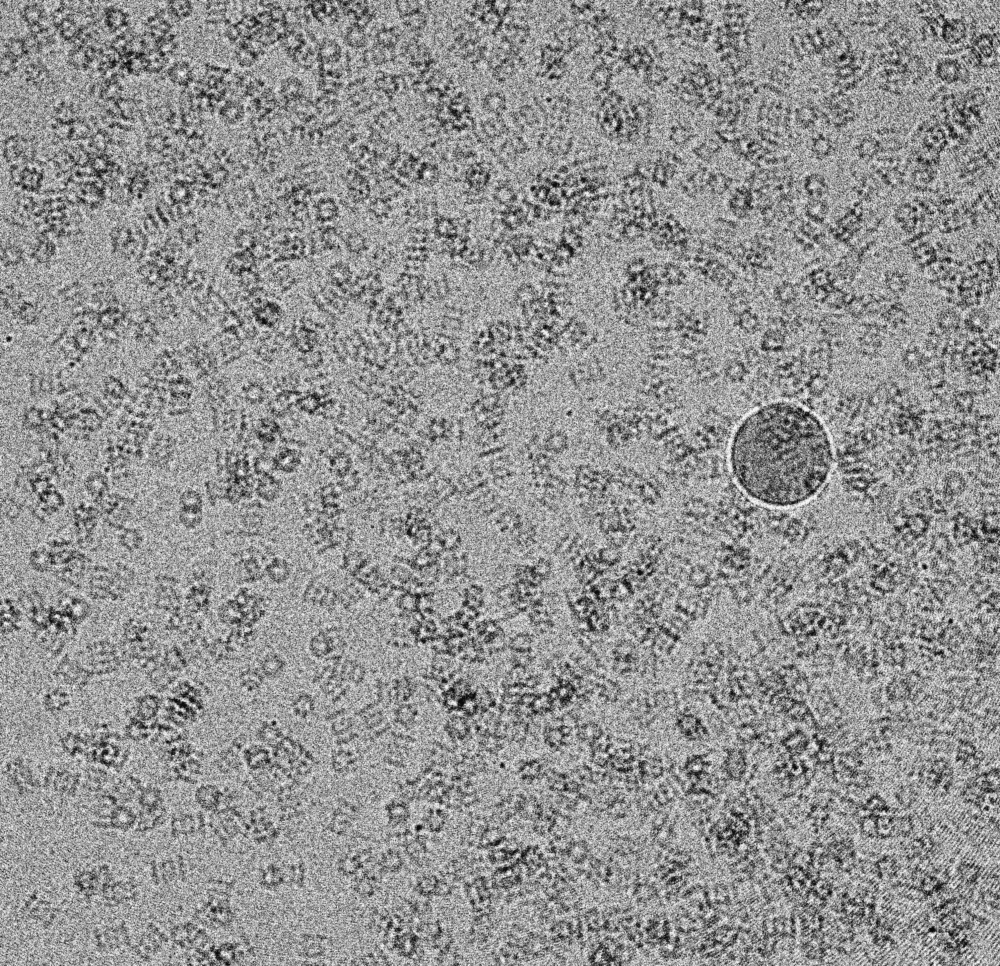
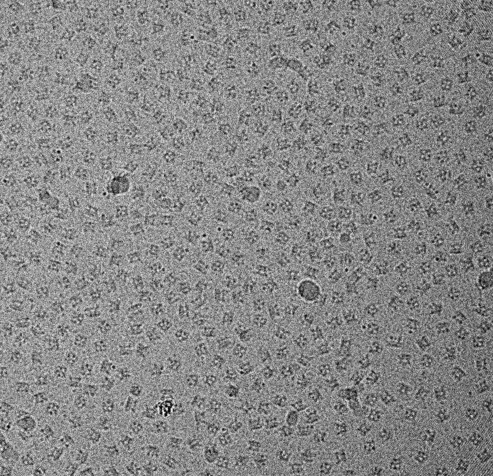

[](https://zenodo.org/doi/10.5281/zenodo.13742234)
# VirtualIce: Half-synthetic CryoEM Micrograph Generator

VirtualIce is a feature-rich half-synthetic cryoEM micrograph generator that uses buffer cryoEM micrographs with junk and carbon masked out as real background. It projects PDB, EMDB, or local structures onto buffer cryoEM micrographs, simulating realistic imaging conditions by adding noise, dose damage, and applying CTF to particles. It outputs particle coordinates after masking out junk. It outputs particles if requested.

## Release Notes

### v2.0.0beta - September 19, 2024

#### Features

- Multiple structures per micrograph can now be requested (structure sets).
  - Use the same --structures flag followed by either a single structure or multiple. Supports any number of structure sets, like this: 
    - virtualice.py -s 1TIM [1PMA, 50882] [my_structure1.mrc, 3DRE, 6TIM]
  - The above command will make one set of micrographs with only PDB 1TIM, another set with PDB 1PMA and EMD-50882, and another set with a local file (my_structure1.mrc), PDB 3DRE, and PDB 6TIM.
  - Preferred orientation, particle distributions, and overlapping & aggregated particles are fully supported.
  - Filtering of edge, overlapping, and obscured particles is fully supported.
   - Coordinate files are saved independently in .star, .mod, and/or .coord files (one per structure in a structure set).
- This update is significant because it allows for ground-truth datasets of heterogeneous proteins - e.g. continuous or discrete conformations, compositional heterogeneity, or completely different proteins.

<details><summary>v1.0.1 - September 19, 2024</summary><p>
 
   - Last release of VirtualIce for single-structure micrographs. Contains minor printout updates compared to v1.0.0.

</p></details>

<details><summary>v1.0.0 - September 10, 2024</summary><p>
 
   - Generates half-synthetic cryoEM micrographs and particles from buffer images and PDB IDs, EMDB IDs, or local files.
   - Creates coordinate files (.star, .mod, .coord), not including particles obscured by junk/substrate or too close to the edge.
   - Adds Poisson noise and dose-dependent damage to simulated frames and Gaussian noise to particles.
   - Applies the Contrast Transfer Function (CTF) to simulate microscope optics.
   - Control over overlapping particles and particle aggregation.
   - Outputs micrographs in MRC, PNG, and JPEG formats, and optionally cropped particles as MRCs.
   - Multi-core and GPU processing.
   - Extensive customization options including particle distribution, ice thickness, microscope parameters, and downsampling.

</p></details>

## Requirements and Installation

VirtualIce requires Python 3, EMAN2, IMOD, and several dependencies, which can be installed using pip:

```bash
pip install cupy gpustat mrcfile numpy opencv-python pandas scipy SimpleITK
```

To use VirtualIce, clone the github directory, make virtualice.py executable (`chmod +x virtualice.py`), download the ice_images/ directory from EMPIAR-12287 to the VirtualIce/ice_images/ directory, and ensure virtualice.py is in your environment for use.

## Examples


### Example 1 (top-left: PDB 1TIM, 53 kDa, top-right: [1DAT, 442 kDa, 7ZP8, 1385 kDa, and 2HCO, 65 kDa], bottom-left: 1RUZ, 165 kDa, bottom-right: 1PMA, 686 kDa):


### Example 2 (T20S Proteasome; PDB 1PMA, 686 kDa):


### Example 3 (Triose Phosphate Isomerase; PDB 1TIM, 53 kDa):


### Example 4 (TRPV5; EMD 0594, 306 kDa):


## Usage

The script can be run from the command line and takes a number of arguments.

### Basic example usage:

```
virtualice.py -s 1TIM -n 10
```

Generates `-n` _10_ random micrographs of PDB `-s` _1TIM_.

Arguments:

- `-s`, `--structures`: Specify PDB ID(s), EMDB ID(s), local files, and/or 'r' for random PDB/EMDB structures.
- `-n`, `--num_images`: Number of micrographs to generate.

### Basic example usage:

```
virtualice.py -s [1TIM, 11638] 1PMA -n 50
```

Generates `-n` _50_ random micrographs for the structure set consisting of `-s` PDB _1TIM_ and EMDB-_11638_ (multi-structure micrographs), and `-n` _50_ random micrographs of `-s` PDB _1PMA_ (single-structure micrographs).

### Advanced example usage:

```
virtualice.py -s 1TIM r my_structure.mrc 11638 -n 3 -I -P -J -Q 90 -b 4 -D n -ps 2
```

Generates `-n` _3_ random micrographs of PDB `-s` _1TIM_, a <i>r</i>andom EMDB/PDB structure, a local structure called _my_structure.mrc_, and EMD-_11638_. Outputs an `-I` IMOD .mod coordinate file, `-P` png, and `-J` jpeg (quality `-Q` _90_) for each micrograph, and bins `-b` all images by _4_. Uses a `-D` <i>n</i>on-random distribution of particles and `-ps` parallelizes micrograph generation across _2_ CPUs.

Arguments:

- `-I`, `--imod_coordinate_file`: Also output one IMOD .mod coordinate file per micrograph.
- `-P`, `--png`: Output in PNG format.
- `-J`, `--jpeg`: Output in JPEG format.
- `-Q`, `--jpeg-quality`: JPEG image quality.
- `-b`, `--binning`: Bin micrographs by downsampling.
- `-D`, `--distribution`: Distribution type for generating particle locations.
- `-ps`, `--parallellize_structures`: Parallel processes for micrograph generation across the structures requested.


### Advanced example usage:

```
virtualice.py -s 1PMA -n 5 -om preferred -pw 0.9 -pa [*,90,0] [90 180 *] -aa l h r -ne --use_cpu -V 2 -3
```

Generates `-n` _5_ random micrographs of PDB `-s` 1PMA (proteasome) with `-om` _preferred_ orientation for `-pw` 90% (0.9) of particles. The preferred orientations are defined by random selections of `-pa` _[*,90,0]_ (free to rotate along the first Z axis, then rotate 90 degrees in Y, do not rotate in Z) and _[90 180 0]_ (rotate 90 degrees along the first Z axis, then rotate 180 degrees in Y, then free to rotate along the resulting Z). The `-aa` aggregation amount is chosen from _l_ow and _h_igh values _r_andomly for each of the 5 micrographs. `-ne` Edge particles are not included. `--use_cpu` Only CPUs are used (no GPUs). Terminal `-V` verbosity is set to _2_ (verbose). The resulting micrographs are opened with `-3` 3dmod after generation.

Arguments:

- `-om`, `--orientation_mode`: Orientation mode for projections.
- `-pw`, `--preferred_weight`: Weight of the preferred orientations in the range [0, 1].
- `-pa`, `--preferred_angles`: List of sets of three Euler angles (in degrees) for preferred orientations.
- `-aa`, `--aggregation_amount`: Amount of particle aggregation.
- `-ne`, `--no_edge_particles`: Prevent particles from being placed up to the edge of the micrograph.
- `--use_cpu`, Use CPU for processing instead of GPU.
- `-V`, `--verbosity`: Set verbosity level.
- `-3`, `--view_in_3dmod`: View generated micrographs in 3dmod at the end of the run.

Additional arguments exist for fine-tuning the generation process including ice thickness, junk filtering, and CTF parameters.

## Ethical Use Agreement

VirtualIce is under the MIT License, allowing broad usage freedom, but it should be used responsibly and ethically via these guidelines:

### Intended Use

VirtualIce is designed for educational and research purposes, specifically to aid in the development, testing, and validation of cryoEM image analysis algorithms by generating half-synthetic cryoEM micrographs and particles.

### Ethical Considerations

- **Transparency**: Any data generated using VirtualIce should be clearly marked as synthetic when published or shared to distinguish it from real experimental data.
- **No Misrepresentation**: Users should not present synthetic data generated by VirtualIce as real data from physical experiments in any publications or presentations unless explicitly stated.
- **Research Integrity**: Users are encouraged to uphold the highest standards of scientific integrity in their work, ensuring that the use of synthetic data does not mislead, deceive, or otherwise harm the scientific community or the public.

## Issues and Support

If you encounter any problems or have any questions about the script, please [Submit an Issue](https://github.com/alexjnoble/VirtualIce/issues).

## Contributions

Contributions are welcome! Please open a [Pull Request](https://github.com/alexjnoble/VirtualIce/pulls) or [Issue](https://github.com/alexjnoble/VirtualIce/issues).

## Author

This script was written by Alex J. Noble with assistance from OpenAI's GPT, Anthropic's Claude, and Google's Gemini models, 2023-2024 at SEMC.

## License

This project is licensed under the MIT License - see the [LICENSE](LICENSE) file for details.
The Ethical Use Agreement is compatible with the MIT License, providing guidelines and recommendations for responsible use without legally restricting software use.
